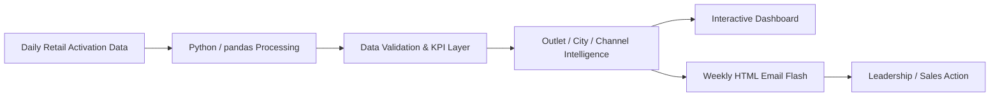

# Traya Retail Intelligence

**Retail activation analytics for promoter-led stores — from daily execution data to weekly business decisions.**

> **Portfolio disclaimer:** This is a portfolio case study built with synthetic / fabricated retail data and masked store identifiers. It is not an official Traya product and does not expose confidential business data.

---

## Project Overview

Promoter-led retail programs generate a lot of daily execution data — shopper walk-ins, relevant shoppers, promoter interactions, sampling, conversion, offtake, stock availability and outlet-level performance.

The challenge is not just reporting these numbers. The real business question is:

> **Why is a store performing the way it is, and what should the business do about it?**

This project turns daily retail activation data into a structured **Retail Intelligence engine** that helps identify:

- where conversion is leaking,
- whether low performance is driven by promoter execution or outlet quality,
- which stores have stockout risk,
- which outlets have headroom to scale,
- which stores should be fixed, protected, scaled or deprioritized,
- and what actions the business should take next.

---

## Business Context

The analysis is designed around a promoter-led retail model for **Traya Hair Care**.

The portfolio dataset contains:

| Metric | Scope |
|---|---:|
| Stores | 60 |
| Working days | 24 |
| Store-day records | 1,440 |
| Period | 1–28 Sep 2026 |
| Sundays | Excluded |
| Store identifiers | Masked |
| Data | Fully synthetic / fabricated |

The data structure mirrors a realistic in-store activation workflow while protecting all sensitive information.

---

## What I Built

### 1. Executive Control Tower
A leadership view that summarizes overall retail execution and quickly answers:

- Are we reaching the right shoppers?
- Are promoters converting shopper interest into buyers?
- Which cities / channels / outlets are driving or dragging performance?
- Where is the largest business opportunity?

### 2. Conversion & Shopper Intelligence
Breaks the funnel into:

**Walk-ins → Relevant shoppers → Interactions → Samples → Buyers**

This helps separate:

- low shopper relevance,
- weak promoter engagement,
- sampling leakage,
- and conversion problems.

### 3. Availability & SKU Intelligence
Tracks product availability and stockout intensity to identify:

- stores with demand but insufficient inventory,
- SKUs repeatedly unavailable,
- potential lost offtake,
- and outlet-level replenishment priorities.

### 4. Outlet Opportunity Engine
Combines execution, conversion, demand and availability signals to classify outlets into practical action buckets such as:

- **Scale**
- **Protect**
- **Fix**
- **Deprioritize**

The goal is to turn analysis into a clear next action for the sales / retail team.

### 5. Weekly Performance Flash
A compact HTML email report designed for Gmail / Outlook delivery, summarizing:

- conversion,
- relevant shoppers,
- offtake,
- week-on-week movement,
- exceptions,
- and recommended actions.

---

## Core KPIs

| KPI | Definition |
|---|---|
| Walk-ins | Total shoppers observed at the outlet |
| Relevant shoppers | Shoppers matching the target consumer profile |
| Category shopper % | Relevant shoppers ÷ Walk-ins |
| Interactions | Shoppers engaged by the promoter |
| Interaction rate | Interactions ÷ Relevant shoppers |
| Samples | Samples / trials given |
| Sampling rate | Samples ÷ Interactions |
| Buyers | Shoppers who purchased |
| Conversion | Buyers ÷ Interactions |
| Offtake | Quantity sold from the outlet |
| Offtake / Buyer | Offtake ÷ Buyers |
| Mandays | Promoter-days deployed at outlets |
| Stockout intensity | Stockout observations ÷ eligible SKU-outlet-days |

A more detailed KPI dictionary is available in [`docs/KPI_DICTIONARY.md`](docs/KPI_DICTIONARY.md).

---

## Analytical Questions Answered

This project is built to answer business questions rather than only display metrics:

1. **Where is conversion breaking down?**
2. **Is an outlet underperforming because of promoter execution or weak shopper relevance?**
3. **Which outlets have demand but are constrained by stock availability?**
4. **Which stores have the strongest potential to scale?**
5. **Where should promoter effort be increased, reduced or redirected?**
6. **Which SKUs create the highest stockout risk?**
7. **Which cities / channels outperform their peer benchmarks?**
8. **What should the field team do next?**

---

## Solution Architecture



The architecture is intentionally lightweight: the focus is on **reliable KPI logic, repeatable analysis and decision-ready communication**.

---

## Tech Stack

| Layer | Tools |
|---|---|
| Data processing | Python, pandas |
| Analysis | Python |
| Visualisation | Plotly / HTML-CSS |
| Reporting | Responsive HTML email |
| Automation | Google Cloud Run, Google Apps Script |
| Source / working files | Excel / CSV |
| Version control | Git, GitHub |

---

## Project Structure

Recommended recruiter-facing structure:

```text
traya-retail-intelligence/
│
├── README.md
├── .gitignore
│
├── data/
│   ├── sample/
│   └── README.md
│
├── src/
│   ├── data_processing/
│   ├── metrics/
│   ├── reporting/
│   └── utils/
│
├── outputs/
│   ├── dashboard/
│   └── email_flash/
│
├── docs/
│   ├── KPI_DICTIONARY.md
│   └── images/
│
├── notebooks/
│   └── exploratory_analysis.ipynb
│
└── scripts/
    └── run_pipeline.py
```

Keep raw / confidential files out of GitHub. Publish only synthetic or sample data.

---

## Key Design Choices

### Business-first KPI design
The metrics are structured around operational decisions rather than vanity reporting.

### Peer benchmarking
Outlet performance can be compared against **City + Channel peers**, making benchmarks more meaningful than a single overall average.

### Funnel diagnostics
The funnel isolates *where* performance is leaking rather than treating low sales as one undifferentiated problem.

### Action-oriented output
The system is designed to move from:

**metric → diagnosis → recommended action**

instead of ending with a dashboard.

### Synthetic portfolio data
All published data is fabricated so the project can demonstrate the analytical approach without exposing company-sensitive information.

---

## Example Outputs

Add 3–5 strong screenshots here before finalising the repository:

1. **Executive Control Tower**
2. **Conversion & Shopper Intelligence**
3. **Availability & SKU Intelligence**
4. **Outlet Opportunity Engine**
5. **Weekly Performance Flash**

Recommended folder:

```text
docs/images/
```

Then embed them in this README, for example:

```markdown

```

---

## How to Run

### 1. Clone the repository

```bash
git clone https://github.com/Kruze-13/traya-retail-intelligence.git
cd traya-retail-intelligence
```

### 2. Create a virtual environment

```bash
python -m venv .venv
```

Windows:

```bash
.venv\Scripts\activate
```

macOS / Linux:

```bash
source .venv/bin/activate
```

### 3. Install project dependencies

If the repository contains `requirements.txt`:

```bash
pip install -r requirements.txt
```

### 4. Add the synthetic input file

Place the portfolio dataset in the documented sample-data location.

### 5. Run the analysis / reporting pipeline

Use the repository's primary runner script or notebook.

> Update this section with the exact command used by the final repository before publishing.

---

## What This Project Demonstrates

For recruiters, this project demonstrates the ability to:

- translate an ambiguous retail problem into measurable KPIs,
- clean and structure operational data,
- diagnose performance using funnel and peer analysis,
- separate demand, execution and availability drivers,
- automate recurring analysis,
- communicate insights through dashboards and email,
- and turn data into concrete business actions.

---

## Limitations

- The published dataset is synthetic and does not represent actual Traya performance.
- The analysis is observational; it does not establish causal impact.
- Store-level outputs depend on the quality and completeness of promoter-entered data.
- The portfolio version prioritizes analytical clarity and reproducibility over production-scale infrastructure.

---

## Future Enhancements

- Automated data-quality alerts before report generation
- Experiment / intervention tracking by outlet
- Predictive outlet opportunity scoring
- Stockout risk forecasting
- Automated narrative insight generation
- Historical campaign effectiveness tracking
- CI checks for KPI logic and data-quality rules

---

## Repository Checklist

Before sharing this repository with recruiters, complete the final polish checklist in:

[`docs/RECRUITER_REPO_CHECKLIST.md`](docs/RECRUITER_REPO_CHECKLIST.md)

---

## Author

**Kishan D Majithia**  
Data Analytics | Business Intelligence | Automation

Add your LinkedIn and portfolio links here.
