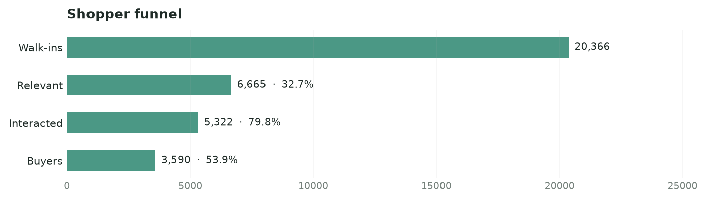
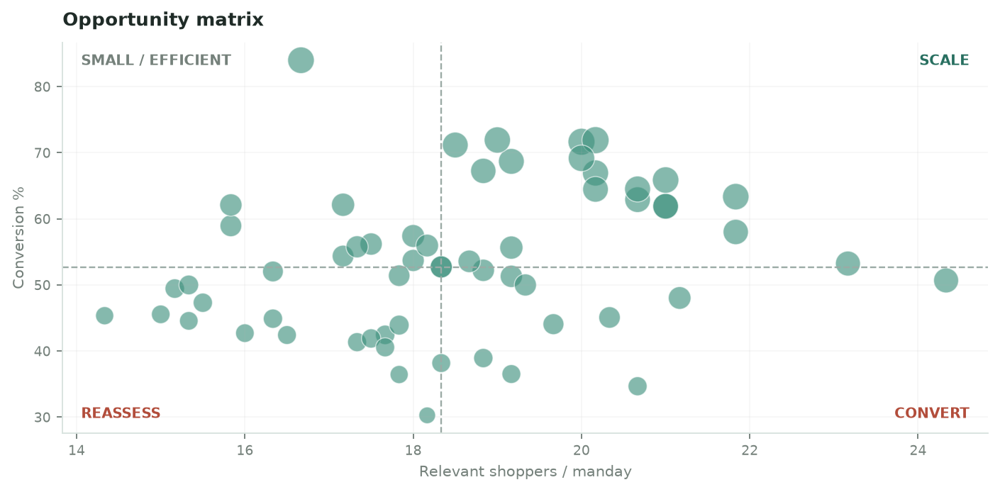
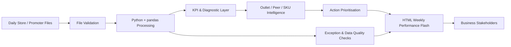
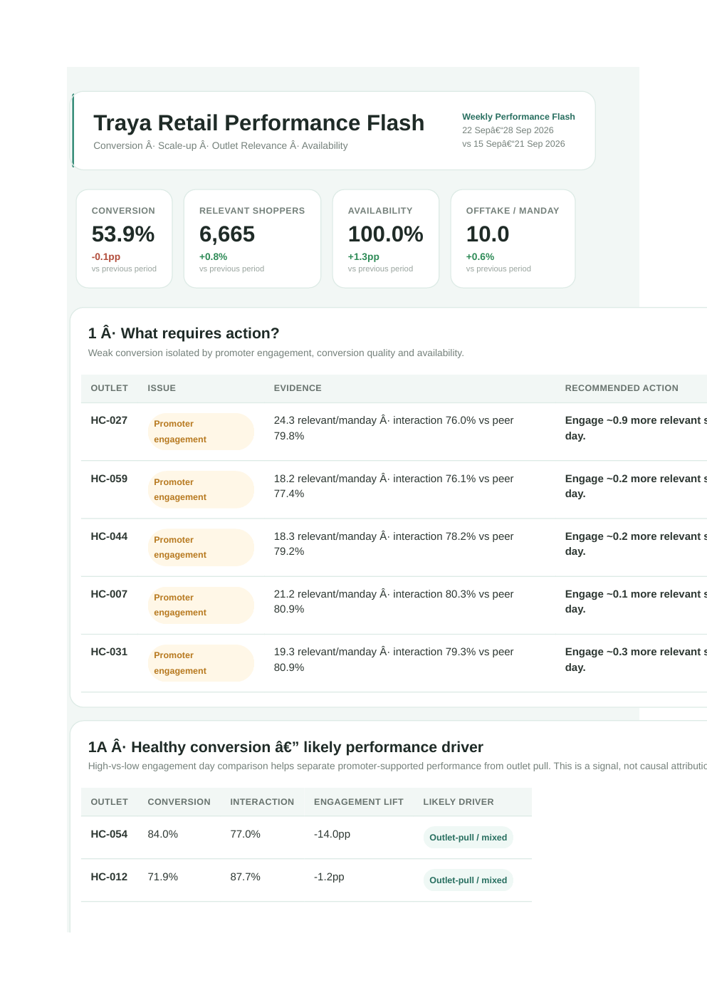

# Traya Retail Intelligence

**A retail activation analytics and automated reporting engine that turns daily promoter-store data into outlet-level actions.**

> **Portfolio disclaimer:** This repository is a portfolio case study built using fully synthetic / fabricated data and masked outlet identifiers. It is not an official Traya product and does not expose confidential business data.

---

## Why This Project Exists

Promoter-led retail programs generate daily operational data across shopper traffic, relevant shoppers, promoter interactions, sampling, buyers, sales and availability.

A normal MIS can tell the business **what happened**.

This project was designed to answer a more useful question:

> **Why is an outlet performing the way it is, and what should the business do next?**

The solution combines retail funnel analysis, promoter productivity, outlet relevance, stock availability and peer benchmarking to identify stores that need intervention and stores with headroom to scale.

---

## Portfolio Scope

| Metric | Scope |
|---|---:|
| Stores | 60 |
| Working days | 24 |
| Store-day records | 1,440 |
| Period used in the portfolio dataset | 1–28 Sep 2026 |
| Sundays | Excluded |
| Outlet identifiers | Masked |
| Published data | Fully synthetic |

The synthetic dataset preserves the analytical structure of a realistic promoter-led retail program while protecting business-sensitive information.

---

## What I Built

### 1. Retail Performance Analytics Engine

Python / pandas processing converts store-day data into business KPIs across:

- shopper relevance,
- promoter engagement,
- sampling,
- conversion,
- offtake,
- promoter productivity,
- SKU availability,
- stockout intensity,
- outlet opportunity.

The objective is not only aggregation. Metrics are structured so weak performance can be diagnosed into different operational causes.

---

### 2. Shopper Funnel Diagnostics

The retail journey is analysed as:

**Walk-ins → Relevant Shoppers → Interactions → Samples → Buyers**

This separates four very different problems:

- **Low outlet relevance** — too few target shoppers are entering the outlet
- **Low engagement** — the promoter is not engaging enough relevant shoppers
- **Low trial generation** — interactions are not progressing to sampling / trial
- **Low conversion** — engagement is not translating into purchase

### Example: Conversion Funnel



Instead of treating low sales as one problem, the funnel identifies **where the leakage occurs**.

---

### 3. Outlet & Promoter Productivity Intelligence

Outlet performance is evaluated using metrics such as:

- relevant shoppers per manday,
- interactions per manday,
- buyers per manday,
- offtake per manday,
- conversion,
- interaction rate,
- outlet relevance.

Peer comparisons help distinguish whether performance is primarily being supported by promoter execution, outlet pull, or a combination of both.

This is intentionally treated as an **analytical signal rather than causal attribution**.

---

### 4. Availability & Stockout Intelligence

Sales opportunity is analysed alongside product availability.

The solution identifies:

- SKUs repeatedly unavailable,
- high-demand outlets constrained by stock,
- stockout intensity,
- potential replenishment priorities,
- locations where execution is healthy but availability limits scale.

This prevents the business from incorrectly treating every low-offtake outlet as a promoter problem.

---

### 5. Outlet Opportunity Engine

The analytics combine shopper relevance, engagement, conversion and availability to prioritise outlets.

Typical action groups include:

| Action | Interpretation |
|---|---|
| **Scale** | Strong relevance, healthy execution and available headroom |
| **Protect** | Strong current performance that should be maintained |
| **Fix** | Attractive opportunity with a clear execution or availability gap |
| **Deprioritize** | Structurally weak outlet opportunity |

### Example: Outlet Opportunity Matrix



The purpose of this layer is to move from:

**metric → diagnosis → priority → action**

---

## Automated Weekly Performance Flash

The project also converts the analytical output into a business-facing HTML email.

A representative synthetic weekly run reports:

| KPI | Current period | Change vs previous period |
|---|---:|---:|
| Conversion | 53.9% | -0.1 pp |
| Relevant Shoppers | 6,665 | +0.8% |
| Availability | 100.0% | +1.3 pp |
| Offtake / Manday | 10.0 | +0.6% |

The email is not limited to headline KPIs. It includes sections such as:

- **What requires action?**
- **Healthy conversion — likely performance driver**
- **Where can we sell more?**
- outlet-level evidence,
- recommended field actions,
- funnel diagnostics,
- opportunity views.

A sample generated HTML output is included here:

[`outputs/email_flash/sample_weekly_performance_flash.html`](outputs/email_flash/sample_weekly_performance_flash.html)

This is a key part of the project: insights are delivered in a format stakeholders can consume directly without opening an analytics notebook.

---

## Business Questions Answered

The engine is designed around practical retail decisions:

1. Which outlets require immediate action?
2. Is weak offtake caused by outlet relevance, promoter execution, conversion or availability?
3. Which promoters are engaging fewer relevant shoppers than comparable outlets?
4. Where is healthy conversion being driven by stronger engagement?
5. Which outlets have demand and execution strength but still have headroom to grow?
6. Which SKUs / outlets are repeatedly affected by stockouts?
7. Which outlets should be scaled, protected, fixed or deprioritized?
8. What is the recommended action for each priority outlet?

---

## Core KPI Framework

| KPI | Definition | Why it matters |
|---|---|---|
| Walk-ins | Total shoppers observed | Available shopper traffic |
| Relevant Shoppers | Shoppers matching the target consumer profile | Outlet relevance |
| Category Shopper % | Relevant Shoppers ÷ Walk-ins | Share of traffic that is commercially relevant |
| Interactions | Relevant shoppers engaged by promoter | Engagement volume |
| Interaction Rate | Interactions ÷ Relevant Shoppers | Promoter engagement effectiveness |
| Samples | Samples / trials delivered | Trial-generation activity |
| Sampling Rate | Samples ÷ Interactions | Movement from engagement to trial |
| Buyers | Shoppers who purchased | Conversion output |
| Conversion | Buyers ÷ Interactions | Effectiveness of promoter interaction |
| Offtake | Quantity sold | Core sales output |
| Mandays | Promoter × outlet × working day | Deployment denominator |
| Offtake / Manday | Offtake ÷ Mandays | Promoter/store productivity |
| Availability % | Available eligible SKU-outlet-days ÷ eligible SKU-outlet-days | Inventory health |
| Stockout Intensity | Stockout observations ÷ eligible SKU-outlet-days | Availability failure intensity |

See [`docs/KPI_DICTIONARY.md`](docs/KPI_DICTIONARY.md) for the detailed KPI definitions.

---

## Analytical Approach

### Funnel decomposition
Sales performance is decomposed into shopper relevance, engagement and conversion rather than analysed as a single number.

### Peer benchmarking
Outlet performance is compared against meaningful peers so a store is not judged only against an overall average.

### Exception-based reporting
The recurring report focuses attention on stores with identifiable problems rather than presenting every store with equal prominence.

### Evidence before recommendation
Outlet recommendations are accompanied by the metrics that triggered the diagnosis.

### Analytical guardrails
Observational relationships are treated as signals. The project does not claim causal impact where the data cannot support it.

---

## Solution Architecture



The workflow is designed so the recurring business output can be automated rather than manually rebuilt each week.

---

## Tech Stack

| Area | Tools |
|---|---|
| Data processing | Python, pandas |
| Analysis | Python |
| Data input / working format | Excel / CSV |
| Visual output | HTML, CSS, generated charts |
| Reporting | Responsive HTML email |
| Automation | Google Cloud Run, Google Apps Script |
| File management / integration | Google Drive API |
| Version control | Git, GitHub |

---

## Repository Structure

```text
traya-retail-intelligence/
│
├── README.md
├── .gitignore
│
├── data/
│   └── ... synthetic / sample inputs
│
├── src/
│   └── ... analytics and reporting logic
│
├── scripts/
│   └── ... pipeline / execution scripts
│
├── notebooks/
│   └── ... exploratory analysis, where applicable
│
├── outputs/
│   └── email_flash/
│       └── sample_weekly_performance_flash.html
│
└── docs/
    ├── KPI_DICTIONARY.md
    └── images/
        ├── conversion-funnel.png
        └── outlet-opportunity-matrix.png
```

> The exact code folders in the repository remain the source of truth. Raw / confidential business files should never be committed.

---

## Example Outputs

### A. Conversion Funnel


**What it demonstrates:** the analysis identifies where the shopper journey is leaking instead of only reporting final offtake.

---

### B. Outlet Opportunity Matrix


**What it demonstrates:** outlets can be prioritised based on business opportunity rather than ranked on a single KPI.

---

### C. Weekly Performance Flash



**What it demonstrates:** the project does not stop at analysis. The output is converted into a stakeholder-ready weekly email that combines:

- KPI movement,
- outlet exceptions,
- peer evidence,
- recommended actions,
- opportunity identification,
- supporting charts.

The email is designed so a business stakeholder can understand **what changed, where attention is required, why it matters, and what action to take next** without opening a notebook or dashboard.

For technical reviewers, the generated HTML source is also included in the repository:

**[View source HTML](outputs/email_flash/sample_weekly_performance_flash.html)**

---

## Data Quality & Reliability Controls

The reporting workflow is designed to handle common operational-data issues, including:

- dynamic input-column detection,
- multiple date formats,
- duplicate file controls,
- missing-file checks,
- configurable channel exclusions,
- masked outlet identifiers,
- validation before KPI calculation.

These controls matter because a recurring analytics product is only useful when the business can trust the refresh.

---

## How to Run

The project is designed as a Python-based analysis and reporting workflow.

A typical local workflow is:

```bash
git clone https://github.com/Kruze-13/traya-retail-intelligence.git
cd traya-retail-intelligence

python -m venv .venv
```

Windows:

```bash
.venv\Scripts\activate
```

macOS / Linux:

```bash
source .venv/bin/activate
```

Then install the dependencies defined by the repository and run the primary project entry point.

> **Note:** use the actual runner / requirements files present in the repository. No credentials or private data should be committed to GitHub.

---

## What This Project Demonstrates

This portfolio project demonstrates the ability to:

- translate an operational business problem into measurable KPIs,
- structure messy store-level data for analysis,
- build a shopper / conversion funnel,
- diagnose performance rather than only describe it,
- benchmark outlets and promoters against peers,
- combine demand and availability signals,
- convert analysis into outlet-level actions,
- automate recurring reporting,
- communicate insights through a stakeholder-ready output.

The emphasis is deliberately on **business analytics + automation**, not on using complexity for its own sake.

---

## Limitations

- All published portfolio data is synthetic and should not be interpreted as actual Traya performance.
- The analysis is observational and does not establish causal impact.
- Store-level conclusions depend on the completeness and accuracy of operational input data.
- Estimated opportunity / headroom is a decision-support signal, not a guaranteed sales forecast.
- This repository is a portfolio implementation rather than a production system operated by Traya.

---

## Potential Enhancements

- intervention tracking to measure whether recommended actions worked,
- stockout risk forecasting,
- experiment / test-control framework for promoter interventions,
- automated anomaly alerts,
- historical outlet opportunity tracking,
- automated narrative insight generation,
- CI tests for KPI logic and input-schema validation.

---

## Author

**Kishan D Majithia**  
Data Analytics | Business Intelligence | Automation

GitHub: [Kruze-13](https://github.com/Kruze-13)
